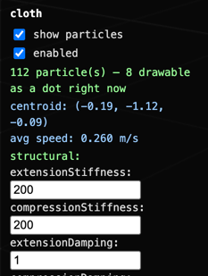
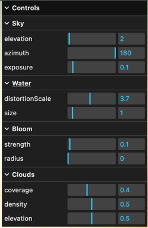

# Scratch Pad

This file contains the author's thoughts on potential features and functionality and
should be ignored by Claude.

## Potential Requirements

* Editing of Vector Expressions:
  * ~~I need the ability to see a field's current vector expression, so I can easily change it.~~
* Flag:
  * ~~The flag's particles should not be able to penetrate the flag surface.~~
  * ~~Make the flag pole taller and sticking up out of the ground as is the case in the MultiShapeScene.~~
  * ~~Create a rope whose top is connected to the top of the pole and whose bottom is connected part way up the pole. Connect the flat to the top portion of the rope.~~
  * ~~The rope and pole should also not penetrate the flag.~~
  * I'd like to see the flag tear, not just go crazy
  * I'd like to visualize the stress of the flag's springs and dampers (separately visible).
* ~~I'd like to be able to set a surface's spring and damper breaking limits.~~
* UI:
  * Make "pause on edit" on by default.
  * I need units on the fields displayed in the panels. e.g. m/s, N, ...
  * Bug: The panels length flickers due to vectors within the panel that, when rendered, exceed the panel's width:
    * You can see the problem in this screenshot, where the centroid vector is breaking across two lines:
    * 
  * In a group panel, I don't need the centroid and avg speed readouts. I would like the ability to turn on/off all of a group's dots.
  * The "show mess edges" checkbox should be part of each of a surface's UI controls and perhaps as a global control within the display panel.
  * The "return to scripted camera" should also be part of the DISPLAY panel as a "scripted camera" check box .
  * Make the "EVENTS" output in the DISPLAY panel an optional panel.
  * UI:
    * Menus:
      * A pull-down menu across the top of the viewer:
        * File | View | Help
        * The File menu should enable me to choose a different model.
        * The View menu should enable me to configure the display, including turning on/off individual display panels.
    * Panels:
      * Panels should be expandable tabs along the left side of the display that, when clicked, open the corresponding panel. All other tabs/panals should move down as necessary.
        * Should work like the right-side panels in Lightroom Classic.
        * Also something like this would be good: 
        * I should have the option (in the View menu) to turn on/off the automatic closing of other panels when a panel is opened.
      * Display Panel
        * "Pause on Edit" should be on by default.
    * Surfaces:
      * I need the display to show a surface as a nested set of entities:
        * 
          * Groups (contains the list of partcle groups that make up the selected surface)
            * <Group 1> 
              * Particles
            * <Group 2>
              * ...
          * Forces - contains a list of forces acting on the selected surface, for example, the flag surface would show:
            * Structural
              * Information and controls about the flag's structural forces
            * Bend
              * Information and controls about the flag's bend forces
            * Shear
              * Information and controls about the flag's shear forces
            * ...
      * When I select a surface or group, I want the option to display the entity's particles.
        * If the particles have a zero radius, display them as we're doing today for a selected flag.
    * Forces
      * Wind
          * ~~Enable me to control the wind as an editable VectorExpr.~~
          * ~~The wind's velocity vector displayed in the wind panel's velocity field has too much precision. Let's limit the precision to 2 decimal places.~~
      * I want the ability to display arrows for any field-force including gravity, not just wind.
    * Floor
      * I'd like the ability to display a floor
    * Colors
      * I'd like the ability to control the colors used in the simulation display:
        * Forces
          * When a force is breakable:
            * I'd like the legend that shows the stress color range to be put into the status bar.
            * I'd like that legend to be green to red by default, with the option to use blue to yellow.
        * Particles
        * 
    * Status Bar
      * Put a status bar at the bottom showing the status of the application.
    * Ways to visualize a particle's path and age. See https://threejs.org/examples/#webgl_postprocessing_unreal_bloom
    * Ways to visualize forces that might also use blooms as in https://threejs.org/examples/#webgl_postprocessing_unreal_bloom
    * Ways to visualize particles:
      * https://threejs.org/examples/#webgl_buffergeometry
      * https://threejs.org/examples/#webgl_buffergeometry_instancing_billboards
      * https://threejs.org/examples/#webgl_buffergeometry_drawrange
    * Swarming Birds:
      * https://threejs.org/examples/#webgl_gpgpu_birds
      * https://threejs.org/examples/#webgl_gpgpu_birds_gltf
      * https://threejs.org/examples/#webgpu_compute_birds
    * https://threejs.org/examples/#webgl_clipculldistance
    * https://threejs.org/examples/#webgl_custom_attributes_lines
    * https://threejs.org/examples/#webgl_custom_attributes_points
    * https://threejs.org/examples/#webgl_custom_attributes_points2
    * https://threejs.org/examples/#webgl_custom_attributes_points3
    * Planet Model
      * https://threejs.org/examples/#webgl_gpgpu_protoplanet
    * Shadows
      * https://threejs.org/examples/#webgl_shadowmap_pcss
    * Particles as light sources
      * https://threejs.org/examples/#webgpu_lights_clustered
      * https://threejs.org/examples/#webgpu_lights_custom
      * https://threejs.org/examples/#webgpu_lights_dynamic
    * https://threejs.org/examples/#webgpu_compute_particles_fluid
